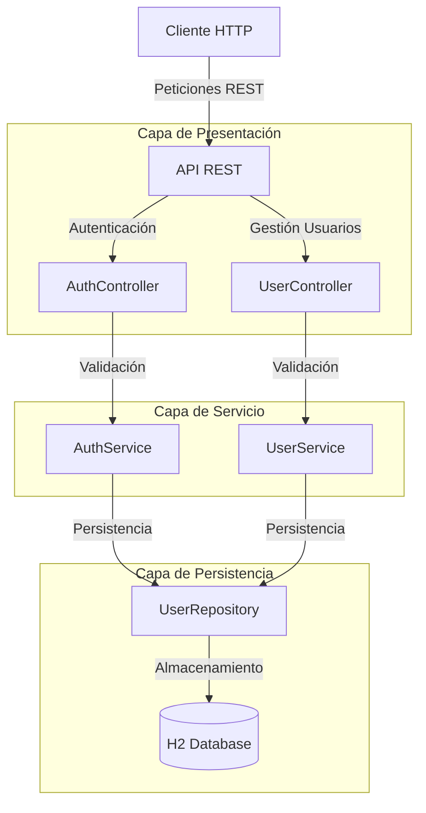
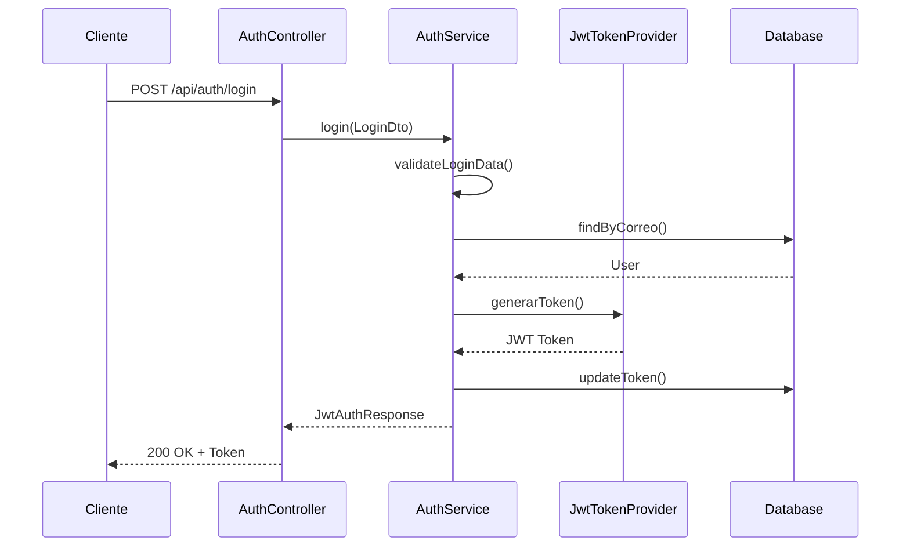
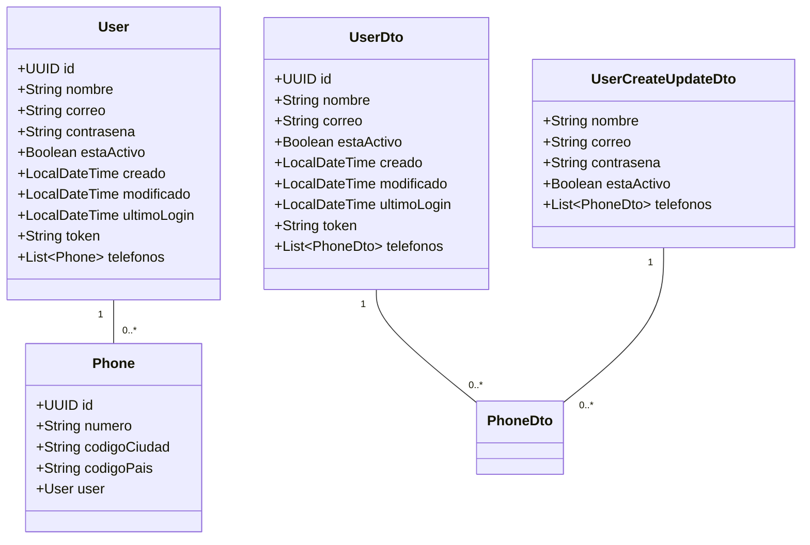

# API de Gestión de Usuarios con Spring Boot

Este proyecto es una API REST desarrollada con Spring Boot que proporciona funcionalidades de gestión de usuarios, autenticación y autorización utilizando JWT (JSON Web Tokens).

## 🚀 Características

- **Autenticación y Autorización**
  - Registro de usuarios
  - Inicio de sesión con JWT
  - Validación de credenciales
  - Protección de endpoints

- **Gestión de Usuarios**
  - Creación de usuarios
  - Actualización de información
  - Listado de usuarios
  - Búsqueda por ID
  - Desactivación de usuarios

- **Validaciones**
  - Formato de correo electrónico
  - Fortaleza de contraseña
  - Campos requeridos
  - Unicidad de correo electrónico

- **Seguridad**
  - Tokens JWT
  - Encriptación de contraseñas
  - Protección contra ataques comunes
  - Manejo de sesiones

## 🛠️ Tecnologías Utilizadas

- Java 8
- Spring Boot 2.7.18
- Spring Security
- Spring Data JPA
- H2 Database
- JWT
- Maven
- Swagger/OpenAPI
- JUnit 5
- JaCoCo (Cobertura de código)

## 📋 Prerrequisitos

- JDK 8 o superior
- Maven 3.6 o superior
- IDE compatible con Spring Boot (recomendado: Visual Studio Code)

## 🔧 Configuración

1. **Clonar el repositorio**
   ```bash
   git clone [URL_DEL_REPOSITORIO]
   cd [NOMBRE_DEL_DIRECTORIO]
   ```

2. **Configurar la base de datos**
   La aplicación utiliza H2 Database en modo memoria. Puedes acceder a la consola H2 en:
   ```
   http://localhost:8000/h2-console
   ```
   
   Configuración en `application.properties`:
   ```properties
   spring.datasource.url=jdbc:h2:mem:testdb
   spring.datasource.driverClassName=org.h2.Driver
   spring.datasource.username=sa
   spring.datasource.password=
   spring.h2.console.enabled=true
   spring.h2.console.path=/h2-console
   ```

   No se necesita ejecutar scrips ya que cuando la aplicación se levante JPA creará las tablas 
   y DataInitializer insertará datos de prueba 
   ```

3. **Compilar el proyecto**
   ```bash
   mvn clean install
   ```

4. **Ejecutar la aplicación**
   ```bash
   mvn spring-boot:run
   ```

## 📚 Documentación de la API

La documentación de la API está disponible a través de Swagger UI cuando la aplicación está en ejecución:

```
http://localhost:8000/swagger-ui/index.html
```

### Autenticación en Swagger UI

Para probar los endpoints protegidos en Swagger UI:

1. Primero, obtén un token JWT usando el endpoint `/api/auth/login` o `/api/auth/registro` o `POST /api/users`
2. En la interfaz de Swagger UI, haz clic en el botón "Authorize" (🔒) en la parte superior
3. En el campo de autorización, ingresa el token en el formato: `Bearer tu_token_jwt`
   - Ejemplo: `Bearer eyJhbGciOiJIUzI1NiIsInR5cCI6IkpXVCJ9...`
4. Haz clic en "Authorize"
5. Ahora podrás probar todos los endpoints protegidos

### Endpoints Principales

#### Autenticación (`/api/auth`)
- `POST /api/auth/registro` - Registro de nuevo usuario
- `POST /api/auth/login` - Inicio de sesión

#### Usuarios (`/api/users`)
- `GET /api/users` - Listar todos los usuarios
- `GET /api/users/{id}` - Obtener usuario por ID
- `POST /api/users` - Crear nuevo usuario
- `PUT /api/users/{id}` - Actualizar usuario
- `PATCH /api/users/{id}/password` - Cambiar contraseña
- `DELETE /api/users/{id}` - Desactivar usuario

## 🔒 Validaciones

### Correo Electrónico
- Formato válido de correo electrónico
- Debe ser único en el sistema
- Campo requerido

### Contraseña
- Mínimo 8 caracteres
- Al menos una letra mayúscula
- Al menos una letra minúscula
- Al menos un número
- Al menos un carácter especial

## 🧪 Testing

El proyecto incluye pruebas unitarias y de integración. Para ejecutar las pruebas:

```bash
mvn test
```

Para ver el reporte de cobertura de código:

```bash
mvn verify
```

El reporte de cobertura se generará en: `target/site/jacoco/index.html`

## 📦 Estructura del Proyecto

```
src/
├── main/
│   ├── java/
│   │   └── com/juan/spring/
│   │       ├── controllers/    # Controladores REST
│   │       ├── services/       # Lógica de negocio
│   │       ├── repositories/   # Acceso a datos
│   │       ├── entities/       # Entidades JPA
│   │       ├── dto/           # Objetos de transferencia de datos
│   │       ├── security/      # Configuración de seguridad
│   │       └── validation/    # Validaciones personalizadas
│   └── resources/
│       └── application.properties
└── test/
    └── java/
        └── com/juan/spring/
            ├── controllers/    # Pruebas de controladores
            ├── services/      # Pruebas de servicios
            └── repositories/  # Pruebas de repositorios
```

## 📊 Diagrama de la Solución

### Arquitectura General


### Flujo de Autenticación


### Estructura de Datos


### Endpoints y Seguridad
```mermaid
graph LR
    subgraph "Endpoints Públicos"
        Login[POST /api/auth/login]
        Register[POST /api/auth/registro]
    end
    
    subgraph "Endpoints Protegidos"
        GetUsers[GET /api/users]
        GetUser[GET /api/users/{id}]
        CreateUser[POST /api/users]
        UpdateUser[PUT /api/users/{id}]
        PatchUser[PATCH /api/users/{id}]
        DeleteUser[DELETE /api/users/{id}]
    end
    
    Client[Cliente] --> |Sin Token| Login
    Client --> |Sin Token| Register
    Client --> |Con Token JWT| GetUsers
    Client --> |Con Token JWT| GetUser
    Client --> |Con Token JWT| CreateUser
    Client --> |Con Token JWT| UpdateUser
    Client --> |Con Token JWT| PatchUser
    Client --> |Con Token JWT| DeleteUser
```

## ✨ Autor

Juan Sepulveda - [jsepulveda0705@gmail.com]